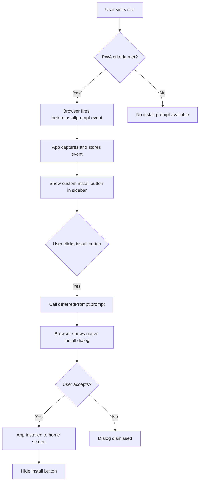

# PWA Install Feature Implementation Plan

## Overview
This plan outlines the implementation of a Progressive Web App (PWA) install feature for the ExpenseAI Next.js application. The feature will display an install button in the sidebar when the browser supports PWA installation, allowing users to install the app on their device's home screen.

## How PWA Install Prompts Work

### Browser Requirements
The browser automatically triggers the `beforeinstallprompt` event when:
1. **Valid Web App Manifest** - A `manifest.json` file with required fields
2. **HTTPS** - Site must be served over HTTPS (or localhost for development)
3. **Service Worker** - A registered service worker that handles fetch events
4. **User Engagement** - User has interacted with the site (varies by browser)

### The Install Flow


## Architecture

### File Structure
```
expenseai/
├── public/
│   ├── manifest.json              # PWA manifest
│   ├── sw.js                      # Service worker
│   ├── icons/
│   │   ├── icon-192.png          # App icon 192x192
│   │   ├── icon-512.png          # App icon 512x512
│   │   ├── icon-maskable-192.png # Maskable icon 192x192
│   │   └── icon-maskable-512.png # Maskable icon 512x512
├── app/
│   └── layout.tsx                 # Updated with manifest link
├── components/
│   ├── app-sidebar.tsx            # Updated with InstallButton
│   └── pwa/
│       └── InstallButton.tsx      # New install button component
├── hooks/
│   └── usePWAInstall.tsx          # New hook for install logic
├── lib/
│   └── utils/
│       └── pwa.ts                 # PWA utilities
└── next.config.ts                 # Updated CSP headers
```

## Implementation Details

### 1. Web App Manifest (`public/manifest.json`)
```json
{
  "name": "ExpenseAI - AI-Powered Expense Tracking",
  "short_name": "ExpenseAI",
  "description": "Track your expenses with AI-powered insights and analytics",
  "start_url": "/dashboard",
  "display": "standalone",
  "background_color": "#000000",
  "theme_color": "#000000",
  "orientation": "portrait-primary",
  "icons": [
    {
      "src": "/icons/icon-192.png",
      "sizes": "192x192",
      "type": "image/png",
      "purpose": "any"
    },
    {
      "src": "/icons/icon-512.png",
      "sizes": "512x512",
      "type": "image/png",
      "purpose": "any"
    },
    {
      "src": "/icons/icon-maskable-192.png",
      "sizes": "192x192",
      "type": "image/png",
      "purpose": "maskable"
    },
    {
      "src": "/icons/icon-maskable-512.png",
      "sizes": "512x512",
      "type": "image/png",
      "purpose": "maskable"
    }
  ],
  "categories": ["finance", "productivity"],
  "screenshots": []
}
```

**Key Properties:**
- `start_url`: Opens to `/dashboard` when launched from home screen
- `display: standalone`: Hides browser UI for app-like experience
- `purpose: maskable`: Allows icons to adapt to different device shapes

### 2. Service Worker (`public/sw.js`)
A minimal service worker that:
- Activates immediately
- Claims all clients
- Implements basic caching strategy for offline support

```javascript
const CACHE_NAME = 'expenseai-v1';
const urlsToCache = [
  '/',
  '/dashboard',
  '/offline'
];

// Install event - cache essential resources
self.addEventListener('install', (event) => {
  event.waitUntil(
    caches.open(CACHE_NAME)
      .then((cache) => cache.addAll(urlsToCache))
  );
  self.skipWaiting();
});

// Activate event - clean up old caches
self.addEventListener('activate', (event) => {
  event.waitUntil(
    caches.keys().then((cacheNames) => {
      return Promise.all(
        cacheNames.map((cacheName) => {
          if (cacheName !== CACHE_NAME) {
            return caches.delete(cacheName);
          }
        })
      );
    })
  );
  self.clients.claim();
});

// Fetch event - network first, fallback to cache
self.addEventListener('fetch', (event) => {
  event.respondWith(
    fetch(event.request)
      .then((response) => {
        const responseClone = response.clone();
        caches.open(CACHE_NAME).then((cache) => {
          cache.put(event.request, responseClone);
        });
        return response;
      })
      .catch(() => caches.match(event.request))
  );
});
```

### 3. PWA Utilities (`lib/utils/pwa.ts`)
```typescript
export function registerServiceWorker() {
  if (typeof window !== 'undefined' && 'serviceWorker' in navigator) {
    window.addEventListener('load', () => {
      navigator.serviceWorker
        .register('/sw.js')
        .then((registration) => {
          console.log('SW registered:', registration);
        })
        .catch((error) => {
          console.log('SW registration failed:', error);
        });
    });
  }
}

export function isPWAInstalled(): boolean {
  if (typeof window === 'undefined') return false;
  
  // Check if running in standalone mode
  return (
    window.matchMedia('(display-mode: standalone)').matches ||
    (window.navigator as any).standalone === true
  );
}
```

### 4. Custom Hook (`hooks/usePWAInstall.tsx`)
```typescript
'use client';

import { useState, useEffect } from 'react';

interface BeforeInstallPromptEvent extends Event {
  prompt: () => Promise<void>;
  userChoice: Promise<{ outcome: 'accepted' | 'dismissed' }>;
}

export function usePWAInstall() {
  const [deferredPrompt, setDeferredPrompt] = 
    useState<BeforeInstallPromptEvent | null>(null);
  const [isInstallable, setIsInstallable] = useState(false);
  const [isInstalled, setIsInstalled] = useState(false);

  useEffect(() => {
    // Check if already installed
    const checkInstalled = () => {
      const isStandalone = 
        window.matchMedia('(display-mode: standalone)').matches ||
        (window.navigator as any).standalone === true;
      setIsInstalled(isStandalone);
    };

    checkInstalled();

    // Listen for beforeinstallprompt event
    const handleBeforeInstallPrompt = (e: Event) => {
      e.preventDefault();
      const promptEvent = e as BeforeInstallPromptEvent;
      setDeferredPrompt(promptEvent);
      setIsInstallable(true);
    };

    // Listen for app installed event
    const handleAppInstalled = () => {
      setIsInstallable(false);
      setIsInstalled(true);
      setDeferredPrompt(null);
    };

    window.addEventListener('beforeinstallprompt', handleBeforeInstallPrompt);
    window.addEventListener('appinstalled', handleAppInstalled);

    return () => {
      window.removeEventListener('beforeinstallprompt', handleBeforeInstallPrompt);
      window.removeEventListener('appinstalled', handleAppInstalled);
    };
  }, []);

  const handleInstallClick = async () => {
    if (!deferredPrompt) return;

    deferredPrompt.prompt();
    const { outcome } = await deferredPrompt.userChoice;
    
    if (outcome === 'accepted') {
      console.log('User accepted the install prompt');
    } else {
      console.log('User dismissed the install prompt');
    }
    
    setDeferredPrompt(null);
    setIsInstallable(false);
  };

  return {
    isInstallable,
    isInstalled,
    handleInstallClick,
  };
}
```

### 5. Install Button Component (`components/pwa/InstallButton.tsx`)
```typescript
'use client';

import { IconDownload } from '@tabler/icons-react';
import { Button } from '@/components/ui/button';
import { usePWAInstall } from '@/hooks/usePWAInstall';

export function InstallButton() {
  const { isInstallable, isInstalled, handleInstallClick } = usePWAInstall();

  // Don't show button if already installed or not installable
  if (isInstalled || !isInstallable) {
    return null;
  }

  return (
    <Button
      onClick={handleInstallClick}
      variant="outline"
      size="sm"
      className="w-full justify-start gap-2"
    >
      <IconDownload className="h-4 w-4" />
      <span>Install App</span>
    </Button>
  );
}
```

### 6. Sidebar Integration
Update [`app-sidebar.tsx`](app-sidebar.tsx) to include the InstallButton:

```typescript
// Add import
import { InstallButton } from '@/components/pwa/InstallButton';

// In the SidebarContent section, add:
<SidebarContent>
  <NavMain items={navMain} />
  <div className="px-2 py-2">
    <InstallButton />
  </div>
  <NavSecondary items={navSecondary} className="mt-auto" />
</SidebarContent>
```

### 7. Layout Updates
Update [`app/layout.tsx`](app/layout.tsx):

```typescript
export const metadata: Metadata = {
  title: "ExpenseAI - AI-Powered Expense Tracking",
  description: "Track your expenses with AI-powered insights and analytics",
  manifest: '/manifest.json',
  themeColor: '#000000',
  appleWebApp: {
    capable: true,
    statusBarStyle: 'black-translucent',
    title: 'ExpenseAI',
  },
  viewport: {
    width: 'device-width',
    initialScale: 1,
    maximumScale: 1,
    userScalable: false,
  },
};

// Add in the <head> section via a client component or script:
// - Service worker registration
// - Apple touch icon links
```

### 8. Next.js Config Updates
Update [`next.config.ts`](next.config.ts) to allow manifest in CSP:

```typescript
// Update the Content-Security-Policy header to include:
"manifest-src 'self'"
```

## Icon Generation

### Required Icon Sizes
1. **Standard Icons:**
   - 192x192px - Minimum required size
   - 512x512px - Recommended for high-res displays

2. **Maskable Icons:**
   - Same sizes as above
   - Include safe zone (80% of icon area)
   - Background should extend to edges

### Icon Design Guidelines
- Use the ExpenseAI brain logo (IconBrain) as the base
- Background: Dark (#000000) to match app theme
- Foreground: Primary color for the brain icon
- Ensure good contrast for visibility
- For maskable icons, keep important elements in the center 80%

## Testing Checklist

### Desktop Browsers
- [ ] Chrome/Edge - Install prompt appears
- [ ] Chrome/Edge - Install button works
- [ ] Chrome/Edge - App launches in standalone mode
- [ ] Firefox - Install prompt appears (if supported)
- [ ] Safari - Add to Dock works (macOS)

### Mobile Browsers
- [ ] Chrome Android - Install banner appears
- [ ] Chrome Android - Install from menu works
- [ ] Safari iOS - Add to Home Screen works
- [ ] Samsung Internet - Install works

### Functionality Tests
- [ ] Service worker registers successfully
- [ ] Manifest loads without errors
- [ ] Icons display correctly in install dialog
- [ ] App opens to `/dashboard` when launched
- [ ] Install button hides after installation
- [ ] Install button doesn't show when already installed
- [ ] Offline functionality works (basic caching)

## Browser Support

### Full Support
- Chrome 67+ (Desktop & Android)
- Edge 79+
- Samsung Internet 8.2+
- Opera 54+

### Partial Support
- Safari 16.4+ (iOS/macOS) - Add to Home Screen, no beforeinstallprompt
- Firefox - Limited PWA support

### Fallback Behavior
- Browsers without PWA support: Install button won't appear
- Safari: Users can manually add to home screen via share menu
- App still functions normally as a web app

## Security Considerations

1. **HTTPS Required** - PWA features only work over HTTPS
2. **CSP Headers** - Ensure manifest and service worker are allowed
3. **Service Worker Scope** - Limited to same origin
4. **No Sensitive Data** - Don't cache sensitive user data in service worker

## Future Enhancements

1. **Advanced Caching Strategy**
   - Cache API responses for offline access
   - Implement background sync for transactions
   - Add offline indicator UI

2. **Push Notifications**
   - Budget alerts
   - Transaction reminders
   - Spending insights

3. **App Shortcuts**
   - Quick add transaction
   - View recent transactions
   - Check budget status

4. **Share Target API**
   - Share receipts to the app
   - Import transaction data

5. **Install Promotion**
   - Show install banner after user engagement
   - Add install prompt to onboarding flow
   - Track install conversion metrics

## Resources

- [Web App Manifest Spec](https://www.w3.org/TR/appmanifest/)
- [Service Worker API](https://developer.mozilla.org/en-US/docs/Web/API/Service_Worker_API)
- [PWA Install Criteria](https://web.dev/install-criteria/)
- [Maskable Icons](https://web.dev/maskable-icon/)
- [Next.js PWA Guide](https://nextjs.org/docs/app/building-your-application/configuring/progressive-web-apps)
